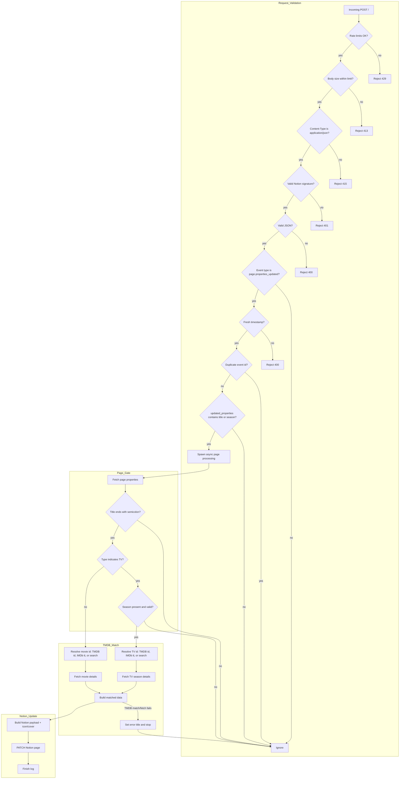

# CineLink Webhook Processing (v2)

Key steps:
- Request validation happens before any Notion/TMDB calls: rate limiting, body size limit, content-type check, signature verification, JSON parsing, event type check, timestamp freshness, and event de-duplication.
- Webhook gating uses `updated_properties` and accepts `title` and a season update indicator (including the raw `Siv%5D` string observed from Notion).
- Title must end with `;` for processing. TV items also require a valid `Season` value.
- Type is treated as TV when the Notion `Type` select value contains `tv` (case-insensitive).
- Title text is used to resolve IDs: numeric TMDB ids or IMDb `tt...` codes bypass search; otherwise TMDB search is used.
- On TMDB match/fetch failure, the page title is set to an error message and processing stops.
- On success, Notion properties are updated and the page icon/cover are set from poster/backdrop.
