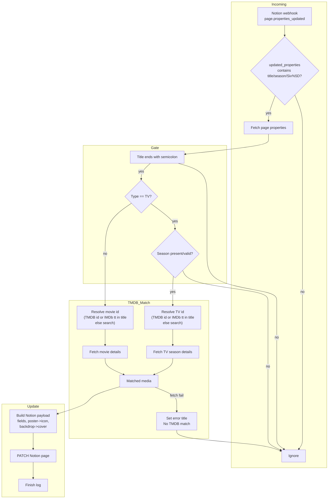

# CineLink Webhook Processing (v2)

Key steps:
- Webhook must list an updated property matching `title`, `season`, or the raw `Siv%5D` string observed from Notion.
- Title must end with `;`. TV requires a valid Season value.
- Title text is used to resolve IDs: numeric TMDB IDs or IMDb `tt...` codes bypass search; otherwise TMDB search is used.
- On match failure, the page title is set to an error message and processing stops.
- On success, Notion is updated (fields + icon/cover) and a completion log is emitted.
