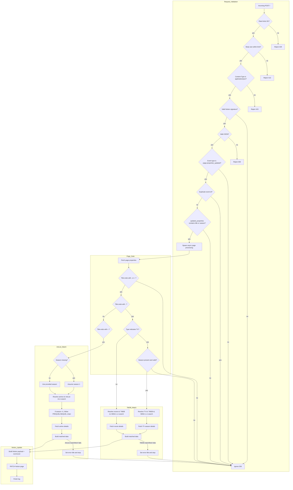

# CineLink Webhook Processing (v2)

Key steps:
- Request validation happens before any Notion/TMDB/AniList calls: rate limiting, body size limit, content-type check, signature verification, JSON parsing, event type check, and event de-duplication.
- Webhook gating uses `updated_properties` and accepts `title` and a season update indicator (including the raw `Siv%5D` string observed from Notion).
- The page is considered “armed” when the title ends with `;` (TMDB) or `=` (AniList).
- TV items (TMDB flow) require a valid `Season` value. AniList uses `Season` to pick sequels but defaults to season `1` when missing.
- Type is treated as TV when the Notion `Type` select value contains `tv` (case-insensitive).
- Title text is used to resolve IDs: numeric ids or IMDb `tt...` codes bypass search; otherwise title search is used.
- On match/fetch failure, the page title is set to an error message and processing stops.
- On success, Notion properties are updated and the page icon/cover are set from poster/backdrop.
